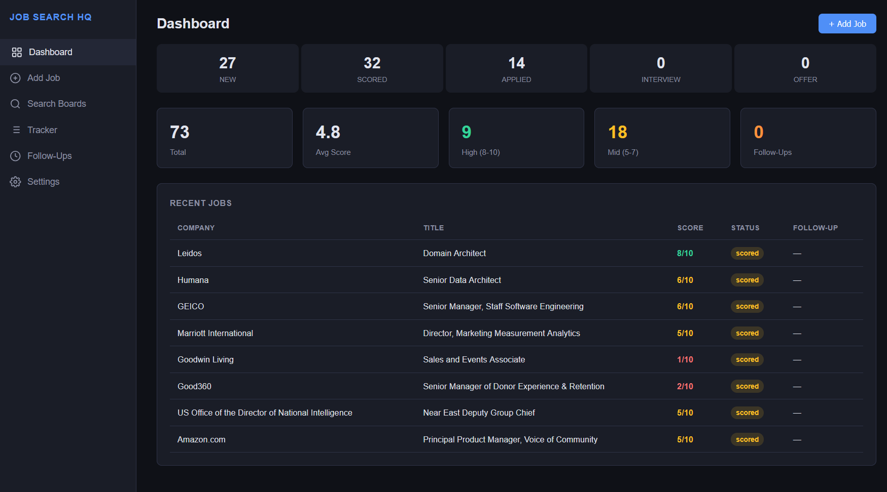
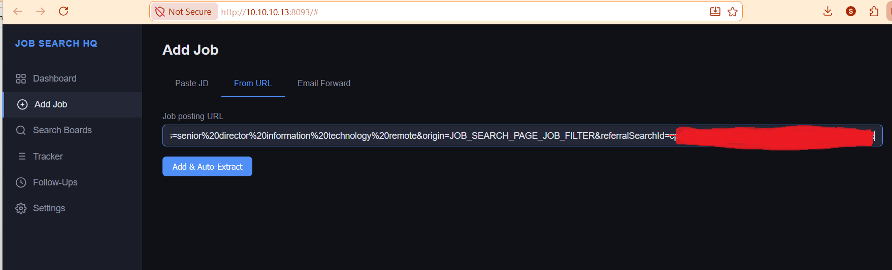
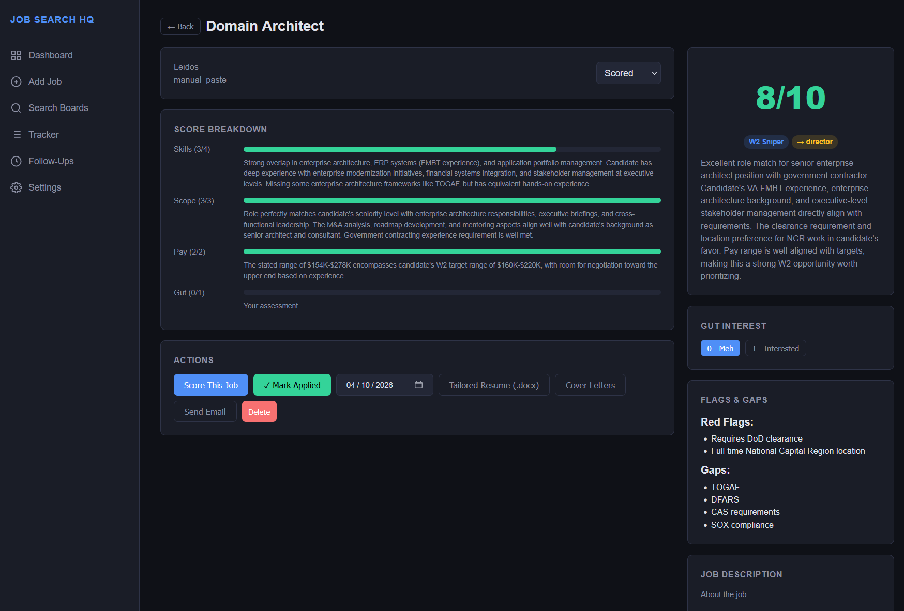
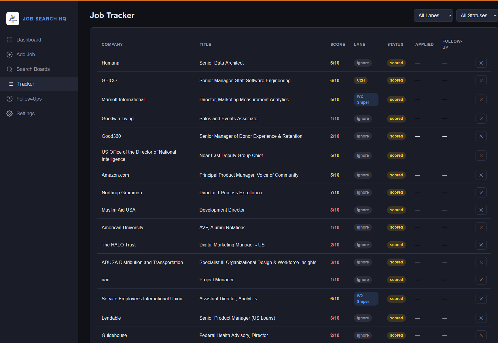
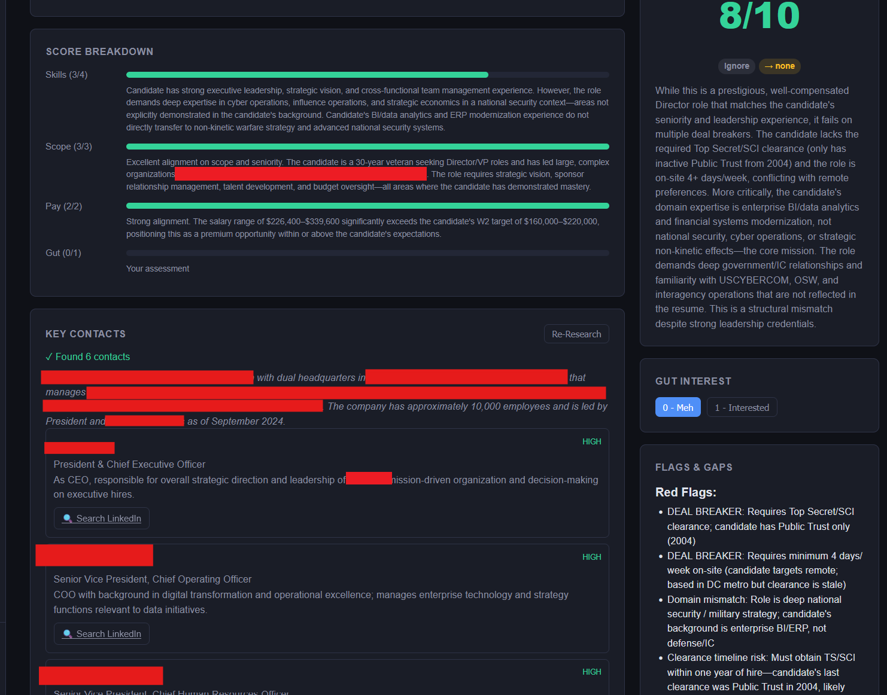

# Job Search HQ

<p align="center">
  
</p>

A lightweight, self-hosted system for capturing, scoring, tracking, and managing job applications — built to bring structure and intelligence to the job search process.

  

**Job searching is fragmented and messy**

* Roles live across LinkedIn, company sites, and job boards designed to make the process arduous
* Applications get lost or duplicated
* There's no clean way to track status, follow-ups, or notes
* You have no idea who to contact at a company

Most people default to spreadsheets (or chaos).

**Job Search HQ** is a Docker-based app that lets you:
* Scrape job listings from multiple boards at once
* Automatically score each job against your background using Claude AI
* Research key contacts at any company with one click
* Track applications, follow-ups, and generated documents in one place

## Features

- **Multi-board job search** — Scrape Indeed, LinkedIn, Google, Glassdoor, ZipRecruiter via [python-jobspy](https://github.com/speedyapply/JobSpy). Per-board status, deduplication, sequential search (LinkedIn rate-limit aware).
- **AI scoring** — Claude API scores each job against your employment history. Skills match (0–4), scope/impact (0–3), pay alignment (0–2), gut interest (0–1). Auto-assigns W2 Sniper / Contract / Ignore lanes.
- **Company research** — One click finds key contacts at any company: Claude searches the web for the official domain, scrapes leadership pages, and extracts names/titles/relevance notes. Works on JS-rendered sites and IP-blocking sites. LinkedIn search links for every contact.
- **Tailored resumes** — Generates a resume customized to each JD, output as a downloadable `.docx` in your template format.
- **Cover letters** — 3 variants per job (direct, consultative, brief) as `.docx` files.
- **Email integration** — Send applications with `.docx` attachments via Gmail SMTP. Parse confirmation emails to extract recruiter contact info.
- **Follow-up tracking** — Auto-schedules follow-ups when you mark "Applied." Snooze, mark done, email digest.
- **Application tracker** — Pipeline view with sortable columns. Filter by lane and status.
- **Batch scoring** — Score all unscored jobs with descriptions in one click.
- **Scheduled automation** — Daily job search at a configured time, auto-score new results, auto-generate docs above a score threshold.
- **Multi-user OIDC auth** — Authentik SSO with per-user data isolation.
- **AI backend toggle** — Switch scoring between Anthropic API (Haiku) and local Ollama in Settings.

## Screenshots

<p align="center">
  <br>
  <em>Dashboard — pipeline funnel, score distribution, recent jobs at a glance</em>
</p>

<p align="center">
  <br>
  <em>Search Boards — scrape Indeed, LinkedIn, Google and more with per-board status</em>
</p>

<p align="center">
  <br>
  <em>Job Detail — AI score breakdown, tailored resume generation, cover letters, email</em>
</p>

<p align="center">
  <br>
  <em>Tracker — sortable columns, filter by lane and status, follow-up tracking</em>
</p>

<p align="center">
  <br>
  <em>Company Research — one click finds key contacts, their titles, relevance notes, and LinkedIn search links</em>
</p>

## Quick Start

```bash
git clone https://github.com/smaniktahla/jobsearchHQ.git
cd jobsearchHQ

# Configure
cp .env.example .env
# Edit .env — add your Anthropic API key:
#   ANTHROPIC_API_KEY=sk-ant-...

# Launch
docker compose up -d --build

# Access at http://localhost:8094
# First run: visit /setup to configure OIDC auth
```

## First Run Setup

1. Visit `/setup` to configure Authentik OIDC (or disable auth for local-only use)
2. **Settings** → Set pay targets (W2 salary range, contract hourly rate)
3. **Settings** → Add Gmail credentials for sending applications
4. **Settings** → Upload "Full Employment History" text (used for AI scoring)
5. **Settings** → Optionally upload resume variants (Director, Base, Contract)
6. **Search Boards** → Run your first search

## Architecture

```
├── main.py              # FastAPI app (30+ endpoints)
├── models.py            # Pydantic data models
├── scoring.py           # Claude API: scoring, cover letters, tailored resumes
├── company_research.py  # Claude web search: find company contacts
├── jobspy_search.py     # python-jobspy multi-board search wrapper
├── docx_builder.py      # .docx generation (resumes + cover letters)
├── email_service.py     # Gmail SMTP send + confirmation email parser
├── auth.py              # Authentik OIDC authentication
├── intake.py            # Pluggable intake handlers (manual/URL/email)
├── storage.py           # Per-user JSON file persistence
├── scheduler.py         # APScheduler daily pipeline (per-user)
├── static/
│   └── index.html       # Complete SPA frontend (dark theme)
├── data/
│   └── users/           # Per-user data (gitignored)
│       └── {oidc_sub}/
│           ├── jobs/
│           ├── resumes/
│           ├── generated/
│           └── config.json
├── Dockerfile
├── docker-compose.yaml
└── requirements.txt
```

## Scoring Rubric

| Dimension | Range | What it measures |
|-----------|-------|-----------------|
| Skills Match | 0–4 | Hard skill overlap with JD |
| Scope/Impact | 0–3 | Seniority and leadership fit |
| Pay Alignment | 0–2 | Comp range vs your targets |
| Gut Interest | 0–1 | Your manual assessment |

**Lane assignment:** 8–10 → W2 Sniper, 5–7 → Contract, <5 → Ignore

## Company Research

Click **Research Company** on any job detail page. The system:

1. Uses Claude with web search to find the company's official domain
2. Searches for leadership team members relevant to your target role (data/analytics leadership, HR/talent acquisition, C-suite)
3. Attempts direct site scraping for additional enrichment
4. Returns contacts with name, title, relevance note, and a LinkedIn search link

Works regardless of whether the company site is plain HTML, JS-rendered, or blocks automated access — because Claude's web search runs from Anthropic's infrastructure.

## Job Board Notes

| Board | Status | Notes |
|-------|--------|-------|
| Indeed | ✅ Best | No rate limiting, full descriptions, salary data |
| LinkedIn | ✅ Works | Sequential search with delay avoids rate limits |
| Google | ⚠️ Varies | Auto-generated search from your query |
| Glassdoor | ❌ Broken | API changes broke JobSpy scraper |
| ZipRecruiter | ⚠️ Varies | Results depend on search terms |

## API Endpoints

<details>
<summary>Click to expand</summary>

| Endpoint | Method | Description |
|----------|--------|-------------|
| `/api/search` | POST | Search job boards via JobSpy |
| `/api/jobs` | GET | List jobs (filter by status/lane) |
| `/api/intake` | POST | Add job via manual/URL/email |
| `/api/jobs/{id}` | GET/PATCH/DELETE | Job CRUD |
| `/api/jobs/{id}/score` | POST | Score job with Claude |
| `/api/jobs/{id}/research` | POST | Research company contacts |
| `/api/jobs/{id}/tailored-resume` | POST | Generate tailored resume + .docx |
| `/api/jobs/{id}/download-resume` | GET | Download .docx resume |
| `/api/jobs/{id}/cover-letters` | POST | Generate 3 cover letter variants |
| `/api/jobs/{id}/cover-letters/{lid}/download` | GET | Download cover letter .docx |
| `/api/jobs/{id}/send-email` | POST | Send email with attachments |
| `/api/jobs/{id}/parse-confirmation` | POST | Parse confirmation email |
| `/api/jobs/{id}/mark-followed-up` | POST | Mark follow-up complete |
| `/api/jobs/{id}/snooze-follow-up` | POST | Snooze follow-up N days |
| `/api/jobs/score-batch` | POST | Batch score multiple jobs |
| `/api/follow-ups` | GET | Get due/upcoming follow-ups |
| `/api/follow-ups/send-digest` | POST | Send follow-up email digest |
| `/api/config` | GET/PUT | App configuration |
| `/api/resumes` | GET | List resume variants |
| `/api/resumes/{variant}` | PUT | Upload resume text |
| `/api/scheduler/status` | GET | Scheduler status |
| `/api/scheduler/run-now` | POST | Trigger pipeline manually |

</details>

## Tech Stack

- **Backend:** FastAPI (Python 3.11)
- **Frontend:** Vanilla HTML/JS/CSS (no build step)
- **AI:** Anthropic Claude API (Haiku for scoring/research, Sonnet for generation)
- **Scraping:** [python-jobspy](https://github.com/speedyapply/JobSpy)
- **Documents:** python-docx
- **Storage:** JSON files (no database)
- **Auth:** Authentik OIDC
- **Deploy:** Docker + APScheduler

## Acknowledgments

- **[JobSpy](https://github.com/speedyapply/JobSpy)** by [speedyapply](https://github.com/speedyapply) — Multi-board job scraping. MIT licensed.
- **[Anthropic Claude API](https://www.anthropic.com)** — AI scoring, research, resume tailoring, cover letter generation.
- **[python-docx](https://python-docx.readthedocs.io/)** — Word document generation.

## License

MIT
